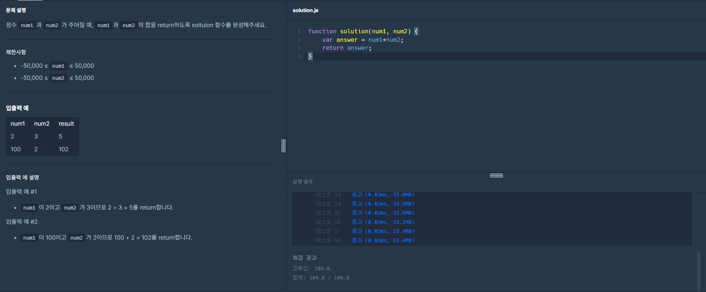

# 프로그래머스 Lv0 두 수의 합

  기초부터 다시 공부를 하기위해 [프로그래머스](https://programmers.co.kr/) 라는 사이트에서
  코딩테스트를 LV0 부터 가능한곳까지 못하는곳은 레퍼런스를 찾아가며 풀어보려고 합니다.
  
  매일 1개의 풀이를 하고 그 풀이에대한 나의 생각 및 해석을 적어보려합니다.

  오늘은 일곱번째 문제 '두 수의 합' 문제입니다.

  

  위 이미지가 프로그래머스 코딩문제입니다.
  
  문제는 매개변수로 'num1'과 'num2'값이 주어지면 두 값의 합을 출력해야하는 문제 입니다.   
  
  이번에문제에서는 산술 연산자를 사용해보겠습니다.

  이제 기본 세팅 코드도 알아보겠습니다.
  
```javascript
function solution(num1, num2) {
    var answer = -1;
    return answer;
}
``` 
기본 함수 형태는 함수 내부에 answer이라는 변수를 선언하고 그변수를 return 해주는 기본적인 함수의 형태입니다.

함수안에 매개변수로 num1,num2가 있습니다. 출제자가 해당 매개변수에 임의의 값을 넣어주면
함수의 리턴 값으로 답을 알려주면 되는 간단한 코드 입니다.

이전에 풀어봤던 '두 수의 차' 문제와 같은 간단한 더하기 문제 입니다.

그럼 바로 시작해볼까요?

```javascript
function solution(num1, num2) {
    var answer = num1+num2;
    return answer;
}
console.log(solution(10,10))
``` 
저는 위 코드에서 매개변수인 num1 과 num2 를 산술연산자 '+' 기호로 더하기를 해줬습니다.
그리고 그 값에 대한 답을 answer이라는 변수에 담아주었습니다.
이제 return 값을 변수인 answer으로 지정해주면, 이 함수는 num1+num2의 값을 반환할것입니다.

저는 매개변수num1의 값으로 10, 매개변수num2의 값으로 10 이렇게 넣어 주었습니다.

콘솔창을 한번 보겠습니다.   

결과는 20 입니다.

이제 원하는 결과가 나오고 함수가 원하는대로 작동하니 프로그래머스에서 결과를 확인해 보겠습니다.



성공이네요!

오늘은 [프로그래머스](https://programmers.co.kr/) LV0 '두 수의 합' 문제의 대해서 알아봤습니다.

감사합니다.