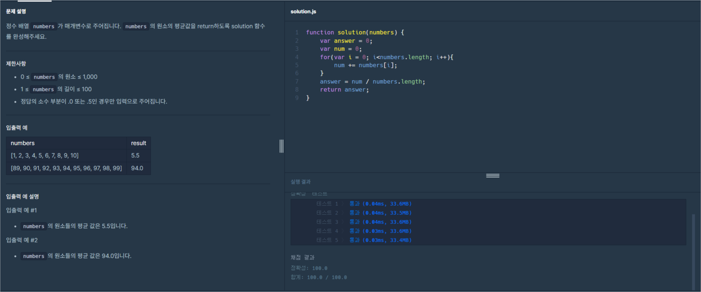

# 프로그래머스 Lv0 배열의 평균값

  기초부터 다시 공부를 하기위해 [프로그래머스](https://programmers.co.kr/) 라는 사이트에서
  코딩테스트를 LV0 부터 가능한곳까지 못하는곳은 레퍼런스를 찾아가며 풀어보려고 합니다.
  
  매일 1개의 풀이를 하고 그 풀이에대한 나의 생각 및 해석을 적어보려합니다.

  오늘은 여덟번째 문제 '배열의 평균값' 문제입니다.

  

  위 이미지가 프로그래머스 코딩문제입니다.
  
  문제는 매개변수'numbers'에 배열을 전달 하면 그 배열이 갖고 있는 모든 값의 평균 값을 구하는 문제 입니다.

  이번문제에서는 반복문인 `for()`문을 사용해보겠습니다.

### 반복문이란?
  반복문(Loop)은 프로그래밍에서 동일한 코드 블록을 여러 번 실행하는 제어 구조입니다. 이는 특정 작업이나 명령을 반복적으로 수행할 때 사용됩니다. 반복문은 주어진 조건이 참(True)인 경우 코드 블록을 반복해서 실행하고, 조건이 거짓(False)이 되면 반복이 중단됩니다.
#### for
일정한 조건에 따라 코드 블록을 반복 실행합니다. for문은 주로 반복 횟수가 명확할 때 사용됩니다.
+ 예시 :
    + ```javascript
      for (초기화; 조건; 증감) {
        // 실행될 코드
      }
      ```

#### forEach
배열의 각 요소에 대해 주어진 함수를 실행합니다. 배열을 순회할 때 사용됩니다.
+ 예시 :
    + ```javascript
      배열.forEach(function(요소, 인덱스, 배열) {
        // 실행될 코드
      });
      ```

#### for of
반복 가능한(iterable) 객체의 요소들을 반복합니다. 주로 배열이나 문자열과 같이 순회할 수 있는 자료구조에서 사용됩니다.
+ 예시 :
    + ```javascript
      for (변수 of iterable) {
        // 실행될 코드
      }
      ```

#### for in
객체의 열거 가능한 속성들을 반복합니다. 주로 객체의 속성을 순회할 때 사용됩니다.
+ 예시 :
    + ```javascript
      for (변수 in 객체) {
        // 실행될 코드
      }
      ```


  이제 기본 세팅 코드도 알아보겠습니다.
  
```javascript
function solution(numbers) {
    var answer = 0;
    return answer;
}
``` 
기본 함수 형태는 함수 내부에 `answer`이라는 변수를 선언하고 그변수를 `return` 해주는 기본적인 함수의 형태입니다.

함수안에 매개변수로 `numbers`가 있습니다. 출제자가 해당 매개변수에 임의의 배열을 넣어주면
함수의 리턴 값으로 해당 배열의 전체를 합친 값에서 평균치를 알려주면 되는 간단한 코드 입니다.

그럼 바로 시작해볼까요?

```javascript
function solution(numbers) {
    var answer = 0;
    var num = 0;
    return answer;
}
```    

저는 우선 변수를 만들어서 여기에 전체배열의 값을 합친 값을 넣을겁니다.   

```javascript
function solution(numbers) {
    var answer = 0;
    var num = 0;
    for(var i = 0; i<numbers.length; i++){
        num += numbers[i];
    }
    // return answer;
    console.log(num)
}
var arr = [100,200,300,400,500,600,700,800,900,1000]
solution()
``` 
이제 반복문중 `for`문으로 시도를 해보겠습니다.
for문의 초깃값은 i라는 변수는 0으로 설정해주고 i가 매개변수로 들어온 배열의 `lenth` 값보다 작으면 반복을하고 실행이 끝나면 아이를 증가시켜주는 `++`연산자를 넣어주었습니다.
실행문에는 `num`이라는 변수에 `numbers`배열에 `[i]`번째 값을 `+=`으로 더해주고 있습니다.
그리고 저는 저 함수를 실행하기 위해 한번 테스트용 변수를 만들어서 넣고 잠시 `return`을 주석처리해주고 콘솔에서 확인해보겠습니다.

결과는 5500입니다. 성공적으로 제가 만든 변수에 모든 배열의 값을 합한 값을 담았습니다.
이제 이 합한 값에서 평균을 내려면 합한 값 나누기 배열의 갯수를 해주면 되겠죠.

바로 시도해보겠습니다.

```javascript
function solution(numbers) {
    var answer = 0;
    var num = 0;
    for(var i = 0; i<numbers.length; i++){
        num += numbers[i];
    }
    answer = num / numbers.length;
    // return answer;
    console.log(answer)
}
var arr = [100,200,300,400,500,600,700,800,900,1000]
solution()
``` 

위 코드에서는 `/`연산자로 num에 담겨있는 값을 numbers.length으로 나눠주었습니다.

결과는 550입니다. 성공적으로 평균값을 구했습니다.

이제 원하는 결과가 나오고 함수가 원하는대로 작동하니 프로그래머스에서 결과를 확인해 보겠습니다.

```javascript
function solution(numbers) {
    var answer = 0;
    var num = 0;
    for(var i = 0; i<numbers.length; i++){
        num += numbers[i];
    }
    answer = num / numbers.length;
    return answer;
}
``` 
제출용으로 정리한 코드는 위와 같습니다.



성공이네요!

오늘은 [프로그래머스](https://programmers.co.kr/) LV0 '배열의 평균값' 문제의 대해서 알아봤습니다.

감사합니다.