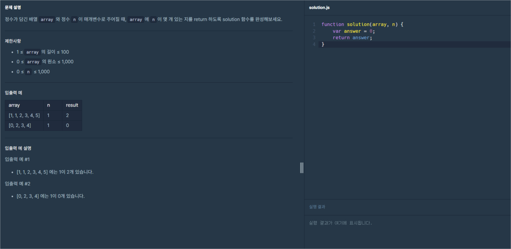
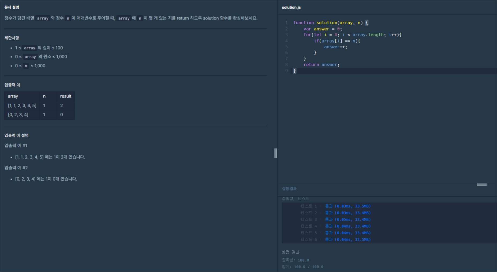

# 프로그래머스 Lv0 중복된 숫자 개수

  기초부터 다시 공부를 하기위해 [프로그래머스](https://programmers.co.kr/) 라는 사이트에서
  코딩테스트를 LV0 부터 가능한곳까지 못하는곳은 레퍼런스를 찾아가며 풀어보려고 합니다.
  
  매일 1개의 풀이를 하고 그 풀이에대한 나의 생각 및 해석을 적어보려합니다.

  오늘은 열세번째 문제 '중복된 숫자 개수' 문제입니다.

  

  위 이미지가 프로그래머스 코딩문제입니다.
  
  문제는 매개변수 `array`와 `n`이 주어지면 `array`안에 `n`과 같은 숫자가 얼마나 있는지 출력하는 문제입니다.

  이번문제에서는 반복문과 조건문(비교문)을 사용해보도록 하겠습니다.

  이제 기본 세팅 코드도 알아보겠습니다.
  
```javascript
function solution(array, n) {
  var answer = 0;
  return answer;
}
``` 
기존과 같은 기본 함수의 형태입니다. 이번엔 함수에서 `array`와 `n`이라는 매개변수를 입력하고 있습니다.
반복문은 이전 포스팅인 [배열의 평균값](https://spearboy.github.io/posts/programmers_8/#반복문이란) 포스팅에서 확인하실 수 있고,   
조건문(비교문)에 대해서는 이전 포스팅인 [숫자 비교하기](https://spearboy.github.io/posts/programmers_5/#비교문if문) 포스팅에서 확인하실 수 있습니다.   

이번엔 조건을 먼저 작성해보도록 하겠습니다.

조건은 배열로 들어오는 `array`의 몇번째 요소가 `n`과 같은 수인지 체크해야합니다.

저는 그럼 `array[배열의위치] == n`라는 조건이 충족하면 `answer`이라는 변수에 담겨있는 숫자를 1씩 증가하는 조건을 만들겠습니다. 지금 말한것들을 코드로 적으면 아래와 같습니다.
```javascript
function solution(array, n) {
  var answer = 0;
  if(array[0] == n){
    answer++;
  }
  return answer;
}
``` 
이제 조건식을 작성했습니다. 하지만 지금 코드는 배열의 0번째 자리만 체크를 할 수 있습니다.
그럼 모든 배열의 자리를 비교하려면 반복해서 함수를 여러번 호출하거나 조건식을 더 많이 추가해야합니다. 하지만 이런 같은 행동을 쉽게 해주는게 반복문 입니다.

이번 포스팅에서는 이전 포스팅에서 알려드렸던 4가지 반복문의 중 2가지, `for`와 `forEach`의 사용 예시를 이번문제에 적용하여 직접 코드로 작성해서 보여드리도록 하겠습니다.

우선 `for` 입니다.

```javascript
function solution(array, n) {
  var answer = 0;
  for(let i = 0; i < array.length; i++){
    if(array[i] == n){
      answer++;
    }
  }
  return answer;
}
``` 

그다음은 `forEach` 입니다.
```javascript
function solution(array, n) {
  var answer = 0;
  array.forEach((e)=>{
    if(e == n){
      answer++;
    }
  })
  return answer;
}
``` 
이렇게 2가지 반복문의 코드를 보여드렸습니다.

코드가 완성 되었으니 프로그래머스에서 결과를 확인해 보겠습니다.

저는 첫번째 방식인 `for`으로 결과를 제출해보도록 하겠습니다.

```javascript
function solution(array, n) {
  var answer = 0;
  for(let i = 0; i < array.length; i++){
    if(array[i] == n){
      answer++;
    }
  }
  return answer;
}
``` 
제출용으로 정리한 코드는 위와 같습니다.



성공이네요!

오늘은 [프로그래머스](https://programmers.co.kr/) LV0 '중복된 숫자 개수' 문제의 대해서 알아봤습니다.

제 방법이 꼭 정답은 아니니 그저 이런방법도 있구나하고 참고용으로만 봐주시면 감사하겠습니다.

감사합니다.