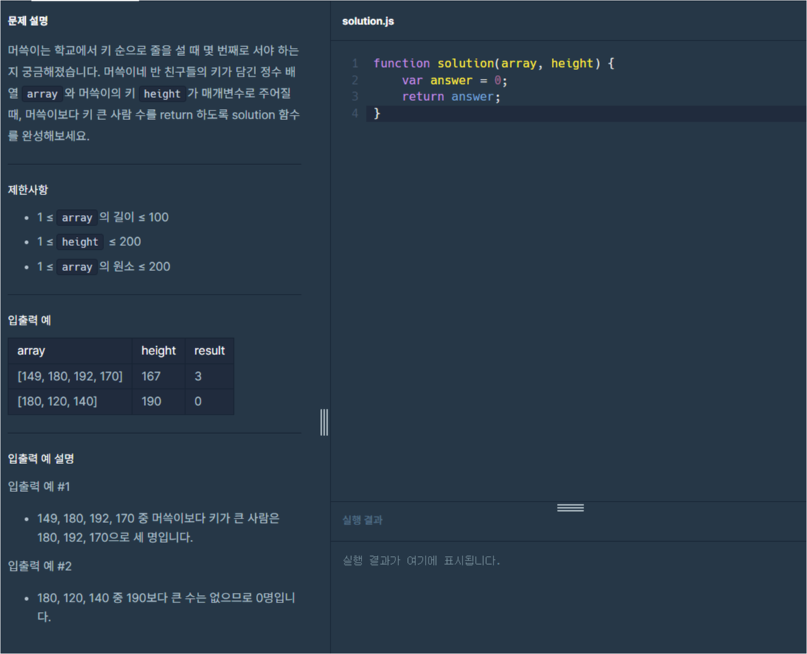
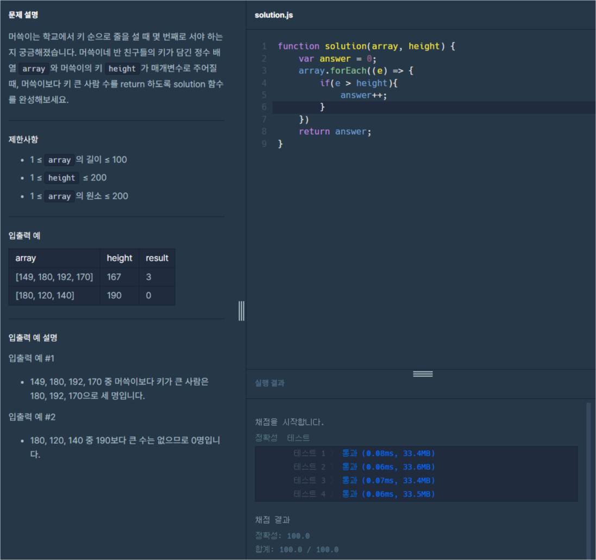

# 프로그래머스 Lv0 머쓱이보다 키 큰 사람

  기초부터 다시 공부를 하기위해 [프로그래머스](https://programmers.co.kr/) 라는 사이트에서
  코딩테스트를 LV0 부터 가능한곳까지 못하는곳은 레퍼런스를 찾아가며 풀어보려고 합니다.
  
  매일 1개의 풀이를 하고 그 풀이에대한 나의 생각 및 해석을 적어보려합니다.

  오늘은 열네번째 문제 '머쓱이보다 키 큰 사람' 문제입니다.

  

  위 이미지가 프로그래머스 코딩문제입니다.
  
  문제는 매개변수 `array`와 `height`이 주어지면 `array`안에 `height`보다 높은 숫자가 얼마나 있는지 출력하는 문제입니다.

  이번문제에서도 이전 포스팅과 같이 반복문과 조건문(비교문)을 사용해보도록 하겠습니다.
  하지만 이번 포스팅에서는 반복문은 `forEach`만 사용하도록 하겠습니다.

  이제 기본 세팅 코드도 알아보겠습니다.
  
```javascript
function solution(array, height) {
  var answer = 0;
  return answer;
}
``` 
기존과 같은 기본 함수의 형태입니다. 이번엔 함수에서 `array`와 `height`이라는 매개변수를 입력하고 있습니다.
반복문은 이전 포스팅인 [배열의 평균값](https://spearboy.github.io/posts/programmers_8/#반복문이란) 포스팅에서 확인하실 수 있고,   
조건문(비교문)에 대해서는 이전 포스팅인 [숫자 비교하기](https://spearboy.github.io/posts/programmers_5/#비교문if문) 포스팅에서 확인하실 수 있습니다.   

이번엔 조건을 먼저 작성해보도록 하겠습니다.

조건은 배열로 들어오는 `array`의 몇번째 요소가 `height`보다 큰 수인지 체크해야합니다.

여기서 잠시 오늘 포스팅에서는 배열을 반복할때 왜 `forEach`를 사용하는지 한번 알아보고 넘어가겠습니다.

### forEach()
forEach() 메서드는 배열의 각 요소에 대해 제공된 함수를 한 번씩 실행하는 배열 메서드입니다. 이를 사용하는 이유는 다음과 같습니다.
  1. 가독성과 간결성: forEach()는 코드를 간결하고 읽기 쉽게 만듭니다. for 루프를 사용하는 대신 forEach()를 사용하면 코드가 더 짧아지고 더 명확해집니다.
```javascript
// for 루프를 사용한 예시
const numbers = [1, 2, 3, 4, 5];
for (let i = 0; i < numbers.length; i++) {
  console.log(numbers[i]);
}

// forEach()를 사용한 예시
const numbers = [1, 2, 3, 4, 5];
numbers.forEach(function(number) {
  console.log(number);
});
```
  2. 배열 요소에 대한 반복 작업: forEach()를 사용하면 배열의 각 요소에 대해 반복 작업을 수행할 수 있습니다. 이는 배열을 반복하면서 각 요소에 대해 동일한 작업을 수행해야 할 때 매우 유용합니다.
```javascript
const numbers = [1, 2, 3, 4, 5];
numbers.forEach(function(number) {
  console.log(number * 2); // 각 요소를 2배로 곱하여 출력
});
```
  3. 인라인 함수 사용: forEach()를 사용하면 인라인 함수를 쉽게 작성할 수 있습니다. 인라인 함수를 사용하면 반복 작업을 보다 간단하게 처리할 수 있습니다.
```javascript
const numbers = [1, 2, 3, 4, 5];
numbers.forEach(number => console.log(number * 2)); // 화살표 함수를 사용하여 인라인 함수 작성
```
  4. 콜백 함수 사용: forEach()의 인자로 전달되는 콜백 함수는 각 배열 요소에 대해 실행됩니다. 이는 forEach()를 사용하여 다양한 작업을 수행할 수 있다는 것을 의미합니다.
```javascript
const numbers = [1, 2, 3, 4, 5];
numbers.forEach(function(number, index, array) {
  console.log(`Index: ${index}, Value: ${number}`); // 각 요소와 해당 인덱스 출력
});
```
  5. 배열 변경 및 사이드 이펙트: forEach()를 사용하면 배열을 변경할 수 있으며, 이는 map()과는 다릅니다. 만약 단순히 배열의 요소를 반복하면서 작업을 수행하고자 할 때라면 forEach()가 적합한 선택입니다.
```javascript
const numbers = [1, 2, 3, 4, 5];
const doubledNumbers = [];
numbers.forEach(function(number) {
  doubledNumbers.push(number * 2); // 각 요소를 2배로 곱하여 새 배열에 추가
});
console.log(doubledNumbers); // [2, 4, 6, 8, 10]
```

이렇게 `forEach`에 대해 한번 알아봤습니다. 위에서 말한것과 같이 저는 주로 1번의 이유때문에 `forEach`를 사용합니다.

다시 문제로 돌아와서 그럼 한번 `forEach`를 코드에 적용해보겠습니다. 배열의 값은 매개변수인 `array`에 전달이 되고 있습니다.
```javascript
function solution(array, height) {
  var answer = 0;
  array.forEach((e) => {
  })
  return answer;
}
``` 
이렇게 `forEach`반복문을 작성해보았습니다. 그럼 이제 조건식만 남았습니다. 조건식도 아주 쉬운 조건식입니다. 바로 한번 조건도 작성해보겠습니다.
```javascript
function solution(array, height) {
  var answer = 0;
  array.forEach((e) => {
    if(e > height){
      answer++;
    }
  })
  return answer;
}
``` 
이제 조건식을 작성했습니다. 그럼 한번 결과를 제출해보도록 하겠습니다.

```javascript
function solution(array, height) {
  var answer = 0;
  array.forEach((e) => {
    if(e > height){
      answer++;
    }
  })
  return answer;
}
``` 
제출용으로 정리한 코드는 위와 같습니다.



성공이네요!

오늘은 [프로그래머스](https://programmers.co.kr/) LV0 '머쓱이보다 키 큰 사람' 문제의 대해서 알아봤습니다.

제 방법이 꼭 정답은 아니니 그저 이런방법도 있구나하고 참고용으로만 봐주시면 감사하겠습니다.

감사합니다.