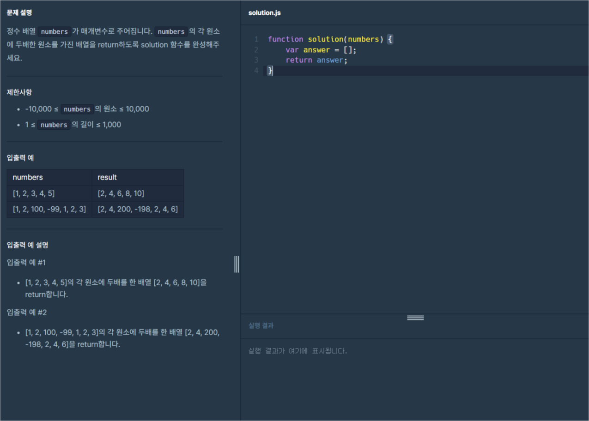
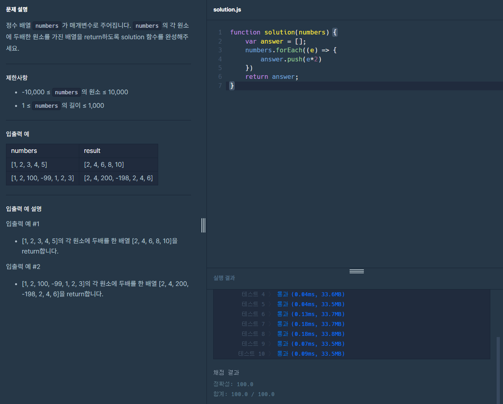

# 프로그래머스 Lv0 배열 두배 만들기

  기초부터 다시 공부를 하기위해 [프로그래머스](https://programmers.co.kr/) 라는 사이트에서
  코딩테스트를 LV0 부터 가능한곳까지 못하는곳은 레퍼런스를 찾아가며 풀어보려고 합니다.
  
  매일 1개의 풀이를 하고 그 풀이에대한 나의 생각 및 해석을 적어보려합니다.

  오늘은 열여섯번째 문제 '배열 두배 만들기' 문제입니다.

  

  위 이미지가 프로그래머스 코딩문제입니다.
  
  문제는 매개변수 `numbers`이 주어지면 `numbers`안에 있는 각 배열의 2배를 배열로 만들어 출력하는 문제입니다.

  이번문제에서는 반복문과 배열 메서드인 `push()`를 사용해보겠습니다.

  이제 기본 세팅 코드도 알아보겠습니다.
  
```javascript
function solution(numbers) {
  var answer = [];
  return answer;
}
``` 
기존과 같은 기본 함수의 형태입니다. 이번엔 함수에서 `numbers`이라는 매개변수를 입력하고 있습니다.
반복문은 이전 포스팅인 [배열의 평균값](https://spearboy.github.io/posts/programmers_8/#반복문이란) 포스팅에서 확인 가능하시고, 이번에 사용할 `push()`메서드는 [배열 메서드](https://spearboy.github.io/posts/programmers_9/#push)포스팅에서 확인하실 수 있습니다.

이번 포스팅에서는 사용할 반복문은 `forEach()`입니다. `forEach()`는 배열에서 사용하기 편한 반복문이라는것은 이전 포스팅에서 다뤄봤습니다.

그럼 한번 반복문을 작성해 보겠습니다.

```javascript
function solution(numbers) {
  var answer = [];
  numbers.forEach((e) => {

  })
  return answer;
}
``` 
이렇게 반복문이 작성되었습니다. `number`이라는 배열의 요소는 `e`으로 정의를 해주었습니다.

그럼 바로 `answer`배열에 각 요소의 2배를 넣어주겠습니다. 2배를 넣어주려면 간단하게 곱하기 연산자인 `*`을 사용해 곱하기 2 를 해주면 될것입니다.
그럼 한번 코드를 작성해 보겠습니다.
```javascript
function solution(numbers) {
  var answer = [];
  numbers.forEach((e) => {
    answer.push(e*2)
  })
  return answer;
}
``` 
이렇게 코드를 완성하였습니다. `numbers`배열의 갯수만큼 `numbers`의 각요소의 2배의 수를 `push()`메서드로 뒤에 추가를 해주었습니다.

그럼 한번 결과를 제출해보도록 하겠습니다.

```javascript
function solution(numbers) {
  var answer = [];
  numbers.forEach((e) => {
    answer.push(e*2)
  })
  return answer;
}
``` 
제출용으로 정리한 코드는 위와 같습니다.



성공이네요!

오늘은 [프로그래머스](https://programmers.co.kr/) LV0 '배열 두배 만들기' 문제의 대해서 알아봤습니다.

제 방법이 꼭 정답은 아니니 그저 이런방법도 있구나하고 참고용으로만 봐주시면 감사하겠습니다.

감사합니다.