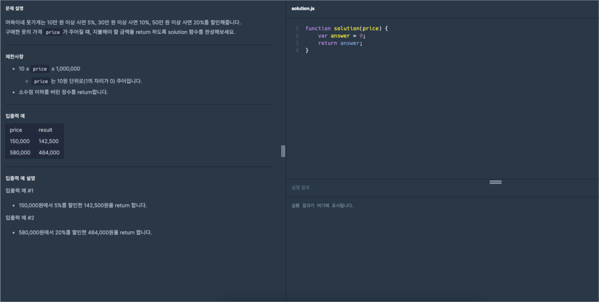
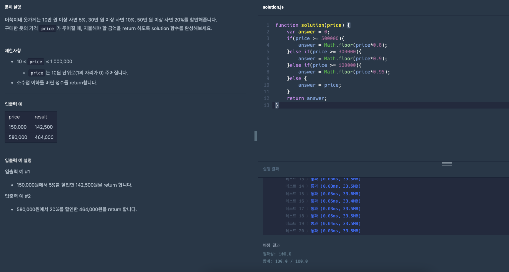

# 프로그래머스 Lv0 옷가게 할인 받기

  기초부터 다시 공부를 하기위해 [프로그래머스](https://programmers.co.kr/) 라는 사이트에서
  코딩테스트를 LV0 부터 가능한곳까지 못하는곳은 레퍼런스를 찾아가며 풀어보려고 합니다.
  
  매일 1개의 풀이를 하고 그 풀이에대한 나의 생각 및 해석을 적어보려합니다.

  오늘은 스무번째 문제 '옷가게 할인 받기' 문제입니다.

  

  위 이미지가 프로그래머스 코딩문제입니다.
  
  문제는 매개변수 `price`이 주어지면 특정 값 이상이면 정해진 조건의 할인된 가격을 출력하는 문제입니다. 처음에 했던 문제들처럼 단순한 계산 문제입니다.

  그럼 문제를 한번 풀어보겠습니다.

  이번 포스팅에서는 조건이 있기때문에 이번 문제에서는 조건문을 사용해보겠습니다.   
  조건문(비교문)에 대해서는 이전 포스팅인 [숫자 비교하기](https://spearboy.github.io/posts/programmers_5/#비교문if문) 포스팅에서 확인하실 수 있습니다. 

  이제 기본 세팅 코드도 알아보겠습니다.
  
```javascript
function solution(price) {
  var answer = 0;
  return answer;
}
``` 
  지금까지의 기본함수와 같은 형태의 기본 함수입니다.
  이번 문제에서는 혹시 모르니 백분율 계산에 대해 한번 설명해 보겠습니다.

### 백분율
백분율을 계산하는 방법은 다양한데요, 가장 기본적인 방법은 다음과 같습니다.

소수를 이용한 방법: 퍼센트 값을 소수로 표현하여 주어진 수에 곱합니다.

분수를 이용한 방법: 퍼센트 값을 분수로 나타낸 후, 주어진 수와 곱하여 결과를 얻습니다.

백분율 공식: 주어진 수를 100으로 나눈 후 퍼센트 값을 곱합니다.

예를 들어, 100의 20%를 계산해보겠습니다.

1. 소수를 이용한 방법: 100 × 0.20 = 20

```javascript
var number = 100; // 주어진 수
var percentage = 0.20; // 백분율을 소수로 표현

// 주어진 수에 백분율을 곱하여 계산합니다.
var result = number * percentage;

console.log(result); // 결과는 20입니다.
```

2. 분수를 이용한 방법: 100 × $\frac{20}{100}$ = 20

```javascript
var number = 100; // 주어진 수
var percentage = 20; // 백분율을 정수로 표현

// 주어진 수와 백분율을 나타내는 분수를 곱하여 계산합니다.
var result = number * (percentage / 100);

console.log(result); // 결과는 20입니다.
```

3. 백분율 공식: $\frac{20}{100}$ × 20 = 20

```javascript
var number = 100; // 주어진 수
var percentage = 20; // 백분율을 정수로 표현

// 주어진 수를 백분율 값으로 나눈 후 곱하여 계산합니다.
var result = (number / 100) * percentage;

console.log(result); // 결과는 20입니다.
```

모든 방법으로 계산한 결과는 모두 20이 나옵니다. 이러한 방법들은 주어진 문제나 상황에 따라 선택할 수 있습니다. JavaScript에서는 주로 소수를 이용하여 계산하는 방법이 더 편리합니다.

이렇게 백분율을 계산하는법을 알았으니 조건식을 한번 작성해 보겠습니다.   
문제에 조건을 보시면 `price`가 10만 이상이면 5%, 30만 이상이면 10%, 50만 이상이면 20%를 `price`에서 빼고 출력해야합니다.

그럼 바로 코드를 작성해보겠습니다. 

```javascript
function solution(price) {
  var answer = 0;
  if(price >= 500000){
    answer = price*0.8;
  }else if(price >= 300000){
    answer = price*0.9;
  }else if(price >= 100000){
    answer = price*0.95;
  }else {
    answer = price;
  }
  return answer;
}
``` 
위 코드처럼 조건식이 완료되었습니다. 하지만 문제를 제출하기에는 아직 부족한점이있습니다. 문제를 보시면 소수점 이하를 버린 정수라고 합니다. 그럼 저희는 여기서 정수를 반환하는 메서드도 함께 사용하도록 하겠습니다.

바로 코드로 작성해보겠습니다.

```javascript
function solution(price) {
  var answer = 0;
  if(price >= 500000){
    answer = Math.floor(price*0.8);
  }else if(price >= 300000){
    answer = Math.floor(price*0.9);
  }else if(price >= 100000){
    answer = Math.floor(price*0.95);
  }else {
    answer = price;
  }
  return answer;
}
``` 
그럼 이제 코드가 완성되었으니 위 코드로 프로그래머스에서 결과를 확인해 보겠습니다.



성공이네요!

오늘은 [프로그래머스](https://programmers.co.kr/) LV0 '옷가게 할인 받기' 문제의 대해서 알아봤습니다.

제 방법이 꼭 정답은 아니니 그저 이런방법도 있구나하고 참고용으로만 봐주시면 감사하겠습니다.

감사합니다.