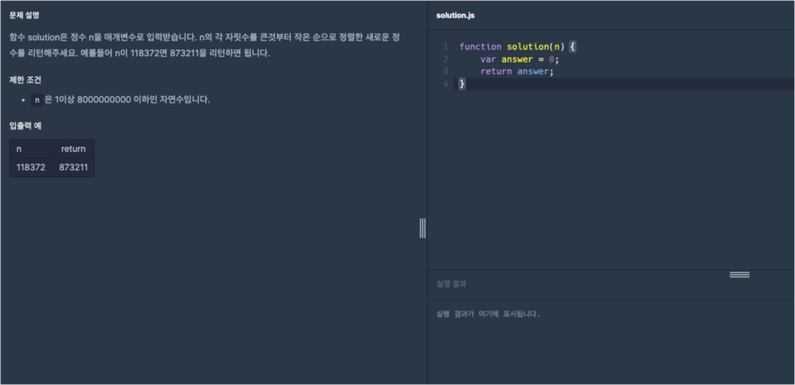
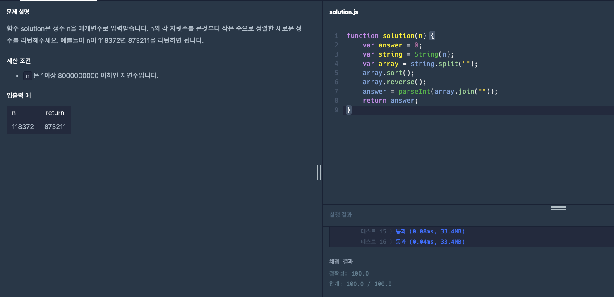

# 프로그래머스 Lv1 정수 내림차순으로 배치하기

  기초부터 다시 공부를 하기위해 [프로그래머스](https://programmers.co.kr/) 라는 사이트에서
  코딩테스트를 LV0 부터 가능한곳까지 못하는곳은 레퍼런스를 찾아가며 풀어보려고 합니다.
  
  매일 1개의 풀이를 하고 그 풀이에대한 나의 생각 및 해석을 적어보려합니다.

  오늘은 LV1 여덟번째 문제 '정수 내림차순으로 배치하기' 문제입니다.

  

  위 이미지가 프로그래머스 코딩문제입니다.
  
  문제는 매개변수로 정수 `n`이 주어지면 `n`의 각 자릿수를 내림차순으로 정렬하는 문제입니다.

  오늘 문제에서는 간단한 메서드들로 문제를 해결해 보겠습니다.

  그럼 오늘의 문제를 한번 풀어보겠습니다.

  기본 세팅 코드도 알아보겠습니다.
  
```javascript
function solution(n) {
  var answer = 0;
  return answer;
}
```

기본 세팅코드는 간단하게 정수`n`을 입력하면 각 자릿수의 숫자를 내림차순으로 정렬하는 문제입니다. 예를 들어 174963 이라면 976431을 반환해야합니다.

그럼 코드로 한번 제가 말한것들을 옮겨보겠습니다.

우선 오늘 사용할 함수중 처음 써보는 `parseInt()`함수를 설명하고 문제를 풀어보도록 하겠습니다.

### parseInt()
`parseInt()`는 JavaScript에서 문자열을 정수로 변환하는 함수입니다. 이와 유사한 다른 함수들로는 `parseFloat()`가 있습니다. `parseInt()`는 문자열을 정수로 변환하는 데 사용되고, `parseFloat()`는 문자열을 부동 소수점 숫자로 변환하는 데 사용됩니다. 오늘은 `parseInt()`만 알아보도록 하겠습니다.

`parseInt()`는 JavaScript에서 문자열을 숫자로 변환할 때 자주 사용됩니다. 문자열을 숫자로 변환할 때 주의할 점은 문자열이 숫자로 시작해야 한다는 것입니다. 그렇지 않으면 NaN(Not a Number)이 반환될 수 있습니다.
+ 예
  + ```javascript
      parseInt("123"); // 123
      parseFloat("3.14"); // 3.14
    ```
+ 예
  + ```javascript
      parseInt("hello"); // NaN
      parseFloat("3.14hello"); // 3.14
    ```

이렇게 간단하게 `parseInt()`에 대해 알아보았습니다. 그럼 다시 문제를 풀어보도록 하겠습니다.

```javascript
function solution(n) {
  var answer = 0;
  var string = String(n);
  return answer;
}
```

우선 저는 위 코드와 같이 매개변수 `n`을 `string`이라는 변수에 `String()`함수를 사용해 문자열로 담아주었습니다. 이유는 문자열로 변환된 `n`을 문자열로 분리하기 위해서 입니다.

```javascript
function solution(n) {
  var answer = 0;
  var string = String(n);
  var array = string.split("");
  return answer;
}
```

이번에는 문자열인 `string`변수를 `split()`메서드를 이용해 `array`라는 변수에 배열로 변환해 다시 담아 주었습니다.

```javascript
function solution(n) {
  var answer = 0;
  var string = String(n);
  var array = string.split("");
  array.sort();
  return answer;
}
```

이번 문제의 첫번째 핵심 정렬입니다. `sort()`메서드를 이용해 오름차순으로 정렬을 해주었습니다.

```javascript
function solution(n) {
  var answer = 0;
  var string = String(n);
  var array = string.split("");
  array.sort();
  array.reverse();
  return answer;
}
```

이번 문제의 두번째 핵심 정렬입니다. `reverse()`메서드를 이용해 오름차순으로 정렬된 배열을 뒤집어주면 내림차순이 될것입니다.

```javascript
function solution(n) {
  var answer = 0;
  var string = String(n);
  var array = string.split("");
  array.sort();
  array.reverse();
  answer = parseInt(array.join(""));
  return answer;
}
```

마지막으로 `join()`으로 다시 합친 `array`를 `parseInt()`으로 정수로 다시 변환해주어 `answer`변수에 담아주면 다시 내림차순으로 변환된 정수를 반환 할 것입니다. 

완성된 코드를 다시 한번 보여드리겠습니다.

```javascript
function solution(n) {
  var answer = 0;
  var string = String(n);
  var array = string.split("");
  array.sort();
  array.reverse();
  answer = parseInt(array.join(""));
  return answer;
}
```

문제의 식이 완성되었으니 프로그래머스에 한번 확인해보겠습니다.



성공이네요!

오늘은 [프로그래머스](https://programmers.co.kr/) LV1 '정수 내림차순으로 배치하기' 문제의 대해서 알아봤습니다.

제 방법이 꼭 정답은 아니니 그저 이런방법도 있구나하고 참고용으로만 봐주시면 감사하겠습니다.

감사합니다.