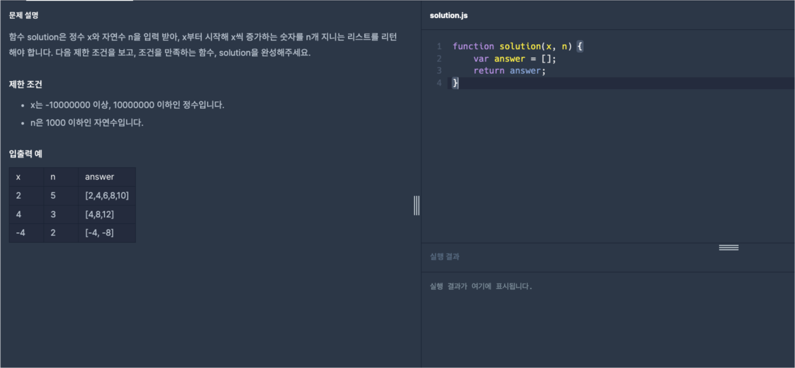
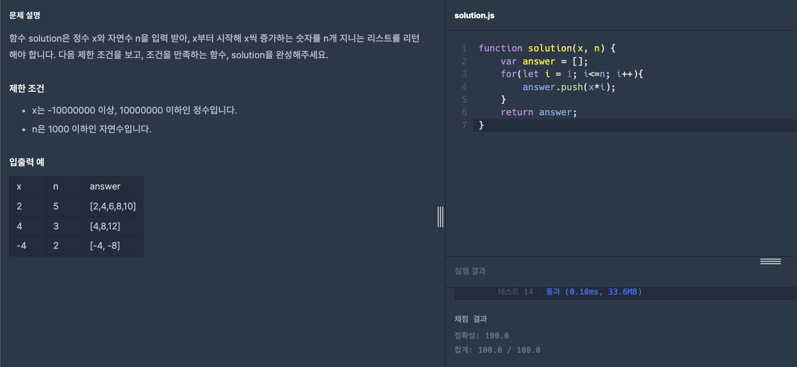

# 프로그래머스 Lv1 x만큼 간격이 있는 n개의 숫자

  기초부터 다시 공부를 하기위해 [프로그래머스](https://programmers.co.kr/) 라는 사이트에서
  코딩테스트를 LV0 부터 가능한곳까지 못하는곳은 레퍼런스를 찾아가며 풀어보려고 합니다.
  
  매일 1개의 풀이를 하고 그 풀이에대한 나의 생각 및 해석을 적어보려합니다.

  오늘은 LV1 열세번째 문제 'x만큼 간격이 있는 n개의 숫자' 문제입니다.

  

  위 이미지가 프로그래머스 코딩문제입니다.
  
  문제는 매개변수로 `x`와`n`이라는 정수가 주어지면 `x`포함한 `x`값만큼 증가하는 정수 `n`개를 배열의 형태로 출력하는 문제입니다.

  오늘 문제에서는 간단한 반복문과 배열 메서드로 문제를 해결해 보겠습니다.

  그럼 오늘의 문제를 한번 풀어보겠습니다.

  기본 세팅 코드도 알아보겠습니다.
  
```javascript
function solution(x, n) {
  var answer = [];
  return answer;
}
```

기본 세팅 코드는 간단하게 `x`와`n`이라는 정수의 매개변수를 전달하며 함수 내에 `answer`배열을 선언해 리턴하는 기본적인 함수의 형태입니다.

이 문제를 해결하는 방법은 매우 간단합니다. 주어진 정수 `x`를 기준으로 시작해서, 그 값을 `n`번 만큼 증가시키며 배열에 저장하는 것입니다. 이를 위해 반복문을 사용하여 `x`에 `i`를 곱한 값을 배열에 추가하고, 마지막에 그 배열을 반환하면 됩니다.

설명을 보충하자면, 우선 `answer`라는 빈 배열을 만듭니다. 그 후에 반복문을 사용하여 `i`가 1부터 `n`까지 증가하도록 설정합니다. 반복문 안에서는 `answer` 배열에 `x` * `i` 값을 추가합니다. 이렇게 하면 `x`부터 시작하여 `x`의 배수들이 `n`개만큼 배열에 추가되는 것이죠.

우선 문제에서 요구하는 것은 정수 `x`와 `n`을 받아서, `x`부터 시작하여 `x`의 간격으로 증가하는 값을 `n`개만큼 배열에 담는 것입니다.

가장 먼저, 주어진 매개변수 `x`와 `n`을 활용하여 결과를 저장할 빈 배열 `answer`를 만듭니다. 그리고 `x`부터 시작하여 `x`의 배수들을 `n`개만큼 차례로 배열에 추가하면 됩니다.

이것을 위해 반복문을 사용합니다. 반복문을 돌면서 `i` 값을 1부터 `n`까지 증가시키며, 각 반복마다 `answer` 배열에 `x` * `i` 값을 추가합니다. 그렇게 하면 `x`부터 시작하여 `x`의 배수들이 배열에 순서대로 추가되는 것이죠.

그럼 예를 들어서 `x`가 2이고, `n`이 5라면, 처음에는 `x`값인 2를 배열에 넣습니다. 그 다음에는 2 * 2로 4를 배열에 넣고, 그 다음에는 2 * 3으로 6을 배열에 넣습니다. 이런 식으로 계속 `x`의 배수들을 배열에 추가하다보면, 결과적으로 [2, 4, 6, 8, 10]이 될 것입니다.

이제 이 방법을 코드로 옮겨보면 됩니다. 위에서 언급한 대로 answer 배열을 만들고, 반복문을 사용하여 `x` * `i` 값을 배열에 추가하면 됩니다. 그리고 마지막으로 `answer` 배열을 반환하면 문제가 해결됩니다.

그럼 이것을 코드로 나타내면 다음과 같습니다.

```javascript
function solution(x, n) {
  var answer = [];
  for(let i = 1; i<=n; i++){
      answer.push(x*i);
  }
  return answer;
}
```

문제의 식이 완성되었으니 프로그래머스에 한번 확인해보겠습니다.



성공이네요!

오늘은 [프로그래머스](https://programmers.co.kr/) LV1 'x만큼 간격이 있는 n개의 숫자' 문제의 대해서 알아봤습니다.

제 방법이 꼭 정답은 아니니 그저 이런방법도 있구나하고 참고용으로만 봐주시면 감사하겠습니다.

감사합니다.