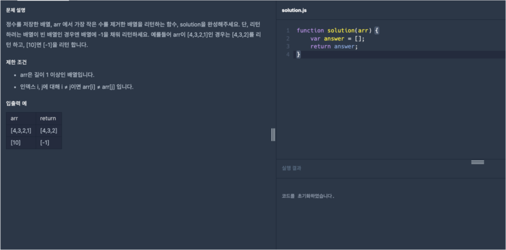
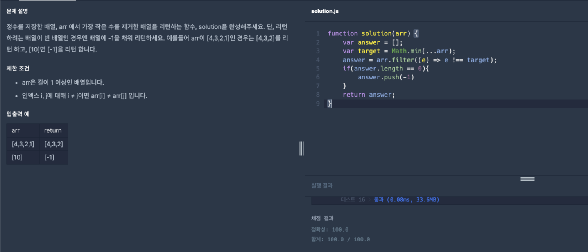

# 프로그래머스 Lv1 제일 작은 수 제거하기

  기초부터 다시 공부를 하기위해 [프로그래머스](https://programmers.co.kr/) 라는 사이트에서
  코딩테스트를 LV0 부터 가능한곳까지 못하는곳은 레퍼런스를 찾아가며 풀어보려고 합니다.
  
  매일 1개의 풀이를 하고 그 풀이에대한 나의 생각 및 해석을 적어보려합니다.

  오늘은 LV1 열다섯번째 문제 '제일 작은 수 제거하기' 문제입니다.

  

  위 이미지가 프로그래머스 코딩문제입니다.
  
  문제는 매개변수로 `arr`이라는 정수가 담겨있는 배열이 주어지면 `arr`안에 있는 요소중 연속으로 나오는 정수는 1개만 남겨 다시 배열의 형태로 출력하는 문제입니다.

  오늘 문제에서는 간단한 조건문과 메서드 그리고 간단한 함수로 문제를 해결해 보겠습니다.

  그럼 오늘의 문제를 한번 풀어보겠습니다.

  기본 세팅 코드도 알아보겠습니다.
  
```javascript
function solution(arr)
{
  var answer = [];
  
  return answer;
}
```

기본 세팅 코드는 간단하게 `arr`이라는 배열의 매개변수를 전달하며 함수 내에 `answer`배열을 선언해 리턴하는 기본적인 함수의 형태입니다.

우선 문제를 풀기전에 오늘 사용할 함수인 `Math.min()`와 `Math.max()`함수를 알아보고 문제를 해결해보겠습니다.

## Math.min()

`Math.min()`함수는 전달된 숫자들 중에서 가장 작은 값을 반환합니다. 이 함수는 임의의 개수의 인수를 받을 수 있습니다. 따라서 인수로 숫자나 숫자로 변환 가능한 값들을 전달할 수 있습니다.   예를 들어,

```javascript
console.log(Math.min(2, 5, 1, 8, 4)); // 1
```

위 코드는 2, 5, 1, 8, 4 중에서 가장 작은 값을 찾아 1을 반환합니다.   또 다른 예로,

```javascript
console.log(Math.min(-10, 0, 5, -3)); // -10
```

위 코드는 -10, 0, 5, -3 중에서 가장 작은 값을 찾아 -10을 반환합니다.


## Math.max()

`Math.max()`함수는 전달된 숫자들 중에서 가장 큰 값을 반환합니다. 마찬가지로 이 함수도 임의의 개수의 인수를 받을 수 있습니다.   예를 들어,

```javascript
console.log(Math.max(2, 5, 1, 8, 4)); // 8
```

위 코드는 2, 5, 1, 8, 4 중에서 가장 큰 값을 찾아 8을 반환합니다.   또 다른 예로,

```javascript
console.log(Math.max(-10, 0, 5, -3)); // 5
```

위 코드는 -10, 0, 5, -3 중에서 가장 큰 값을 찾아 5를 반환합니다.

이렇게 `Math.min()`와 `Math.max()`함수를 알아보았습니다.

그럼 이어서 문제를 풀어보겠습니다. 우선 문제의 핵심인 가장 작은 수를 찾으려면 위에서 알려드렸던 `Math.min()`함수를 사용하는게 좋을것입니다. 그후 해당 숫자를 `filter`메서드를 사용해 찾아내면 될것입니다. 그 후 조건문으로 만약 배열이 빈배열이라면 -1을 배열에 넣어야함으로 `push()`으로 -1 을 넣어주면 문제가 해결됩니다. 

그럼 위 설명을 정리된 코드로 한번 작성해보겠습니다.

```javascript
function solution(arr) {
  var answer = [];
  var target = Math.min(...arr);
  answer = arr.filter((e) => e !== target);
  if(answer.length == 0){
    answer.push(-1);
  }
  return answer;
}
```

문제의 식이 완성되었으니 프로그래머스에 한번 확인해보겠습니다.



성공이네요!

오늘은 [프로그래머스](https://programmers.co.kr/) LV1 '제일 작은 수 제거하기' 문제의 대해서 알아봤습니다.

제 방법이 꼭 정답은 아니니 그저 이런방법도 있구나하고 참고용으로만 봐주시면 감사하겠습니다.

감사합니다.